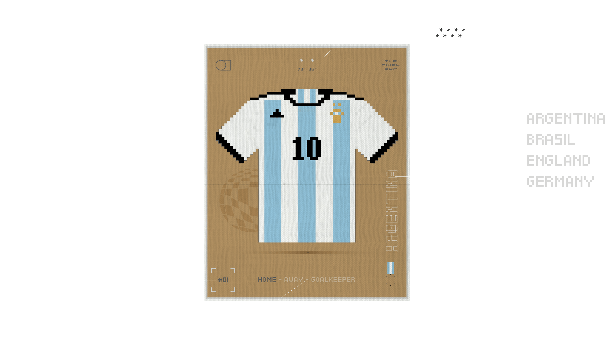

# The biggest sport event in the world

Every four years, the world stands still for a month, and everything revolves around the World Cup. At the same time, the tradition of completing the WC Sticker Album transcends generations and continues growing/

> The WC 2018 physical album broke all previous records and generated a profit of USD 1 billion

For these reasons, we decided to launch our first collection based on the 96 unique jerseys from the 32 national teams participating in the World Cup 2022 in their pixel version (32 home, 32 away y 32 GK).

Every jersey is made up of 4 layers:

1. Pattern
2. Collar
3. Badge + brand logo 
4. Printed number

Based on the printed number, the Home and Away jerseys will have 23 variations and the Goalkeeper jerseys will have 3 variations. Every jersey will represent a real player participating in the WC 2022.

The sticker design for each national team/jersey variation will have the same layout, but different background and border colors.

We are still working on the pixel version of the jerseys while we wait for all countries to release their WC 2022 official national team jerseys.